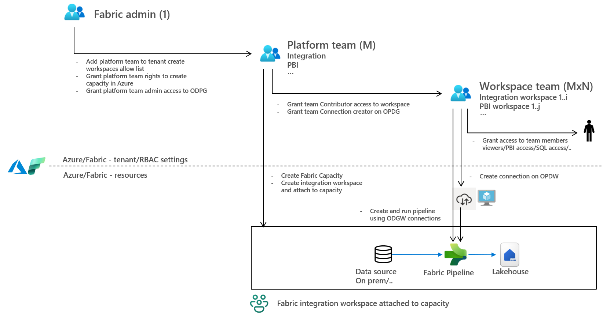

# Fabric federated workspace + OPDG demo


Reference implementation of a **federated** Microsoft Fabric provisioning flow with three personas and three top-level steps: the **Fabric admin** (`1`) runs a one-time bootstrap; the **Platform team** (`M`, Platform SPN) creates the capacity, workspace, and federates gateway access; the **Workspace team** (`M×N`, Team SPN) owns one workspace end-to-end. Three identities, three handoffs, zero shared secrets — `require_identity` enforces the persona boundary at every step.

> Full write-up: see the Medium article [*Microsoft Fabric Operating Model for Multiple Teams*](https://rebremer.medium.com/a-practical-multi-team-operating-model-for-microsoft-fabric-2efc6cb0a8d3) for the end-to-end design rationale and walkthrough that this repo implements.

## Quickstart

Six steps from a clean clone to a running pipeline. Each "run" line is a single command — full CLI variants, sub-steps, and helpers are in [Run](#run) below.

1. **Check prerequisites** — security groups + SPNs + Azure roles per persona ([Prerequisites](#prerequisites-exist-before-running-the-script)).
2. **Install** — Python 3.10+ in a venv ([Setup](#setup)):
   ```powershell
   python -m venv .venv; .\.venv\Scripts\Activate.ps1; pip install -r requirements.txt
   ```
3. **Configure** — copy the three example YAMLs and fill in your IDs ([Configure](#configure)).
4. **Run as Fabric admin (`1`)** — one-time per tenant; `az login` as a human admin or a bootstrap SPN:
   ```powershell
   python scripts/admin/bootstrap.py 1 config/admin/tenant.yaml
   ```
5. **Run as Platform SPN (`M`)** — once per workspace; `az login --service-principal` as the Platform SPN:
   ```powershell
   python scripts/platform_team/integration.py 2 config/platform_team/integration/prod-01.yaml
   ```
6. **Run as Team SPN (`M×N`)** — once per workspace; `az login --service-principal` as the Team SPN:
   ```powershell
   python scripts/workspace_team/integration.py 3 config/workspace_team/integration/prod-01.yaml
   ```

After step 4 the Fabric admin is out of the loop — onboarding additional workspaces is just steps 5 + 6 against new YAML files (`prod-02.yaml`, …). Every script is idempotent: re-running reconciles drift from the YAML.

## Repo layout

Each persona has its own entrypoint script and its own YAML config, so no persona reads or runs code outside its slice:

| Persona | Script | Config |
|---|---|---|
| Fabric admin (`1`) | [scripts/admin/bootstrap.py](scripts/admin/bootstrap.py) | [config/admin/tenant.example.yaml](config/admin/tenant.example.yaml) |
| Platform team (`M`) — integration | [scripts/platform_team/integration.py](scripts/platform_team/integration.py) | [config/platform_team/integration/prod-01.example.yaml](config/platform_team/integration/prod-01.example.yaml) |
| Workspace team (`M×N`) — integration | [scripts/workspace_team/integration.py](scripts/workspace_team/integration.py) | [config/workspace_team/integration/prod-01.example.yaml](config/workspace_team/integration/prod-01.example.yaml) |

The diagram below shows how the three personas hand off responsibility — Fabric admin grants platform security groups, the Platform team grants the workspace team, the Workspace team owns its workspace:



This repo implements the **integration variant** (Platform team that federates OPDG/VDG access; Workspace team that builds an SQL → ADLS Gen2 copy pipeline). The same persona pattern applies to other variants (e.g. a PBI platform team that provisions semantic-model workspaces without OPDG); [scripts/platform_team/pbi.py](scripts/platform_team/pbi.py) and [scripts/workspace_team/pbi.py](scripts/workspace_team/pbi.py) are stubs with docstrings outlining what such a variant would do.


## Personas

| # | Persona | Scope |
|---|---|---|
| **1** | **Fabric admin** (`1`, one-time bootstrap) | Runs all of 1.1 + 1.2 + 1.3 in one command. Can be a **human** Fabric admin (`az login`) *or* a dedicated **bootstrap SPN** holding the Entra **Fabric Administrator** directory role + Owner on the target subscription — the Fabric / ARM APIs called in step 1 accept either. The docs and CLI examples below default to the human path because step 1 is one-time per environment; promote it to an SPN if you run step 1 from CI/CD or across many landing zones. After step 1 the Fabric admin is no longer in the loop. |
| 1.1 | Fabric admin — *tenant allow-list* | Adds `platform_workspace_security_group` to the tenant-setting allow-list for "Service principals can create workspaces, connections, and deployment pipelines" (Fabric tenant-settings Preview API, mandatory — setting names configured under `tenant_settings.enabled_setting_names` in YAML). |
| 1.2 | Fabric admin — *Azure RG + Contributor* | Creates the Azure resource group named in `capacity.resource_group` and grants `platform_workspace_security_group` `Contributor` on it. Replaces the previous manual `az group create` + `az role assignment create` prereq. Requires Owner (or Contributor + User Access Administrator) on the subscription. |
| 1.3 | Fabric admin — *gateway Admin* | Grants `platform_gateway_security_group` `Admin` on the OPDG (1.3a) + VDG (1.3b). Admin is required in practice; lower roles return 403 `InsufficientPermissionsToManageGateway` despite what the docs say. |
| **2** | **Platform team** (`M`, runs as the **Platform SPN**) | Runs all of 2.1 + 2.2 + 2.3 in one command. |
| 2.1 | Platform team — *Fabric capacity* | ARM-creates `Microsoft.Fabric/capacities/<name>` (default `F2`) in the RG provisioned by 1.2, and self-assigns capacity Admin (`administration.members`, a superset of Contributor). Idempotent: re-running PATCHes admins if the capacity already exists. |
| 2.2 | Platform team — *workspace lifecycle* | Creates the workspace bound to the capacity (2.2a); grants `team_workspace_contributor_security_group` `Contributor` on it (2.2b); grants the Team SPN directly `Contributor` on it (2.2c; no-op if `workspace.spn_object_id` is unset). |
| 2.3 | Platform team — *gateway federation* | Grants `team_workspace_contributor_security_group` `ConnectionCreator` (need-to-know; not `ConnectionCreatorWithResharing`, so the Team SPN cannot reshare gateway access) on OPDG (2.3a) + VDG (2.3b). Skip 2.3 for a workspace that doesn't need gateway access. |
| **3** | **Workspace team** (`M×N`, runs as the **Team SPN**) | Runs all of 3.1 + 3.2 + 3.3 in one command. |
| 3.1 | Workspace team — *connections* | Creates the SQL source connection on the OPDG (3.1a) and the ADLS target ShareableCloud connection (3.1b). |
| 3.2 | Workspace team — *pipeline* | Creates / updates the copy pipeline. For real production workspace-item promotion (DEV→PPE→PROD across many pipelines, lakehouses, notebooks, semantic models, …), consider Microsoft's [fabric-cicd](https://microsoft.github.io/fabric-cicd/) library instead — it consumes git-synced item definitions and handles the full deploy. This script keeps 3.2 hand-rolled because the demo's value is in 3.1 (connections / OPDG encryption) and 3.3 (run + poll), which fabric-cicd does not cover. |
| 3.3 | Workspace team — *run pipeline* | Triggers the pipeline run and polls to completion. |

The Workspace team's YAML references the workspace by display name (`workspace.name`) — every script rediscovers Fabric ids (capacity, workspace) by name at runtime, so the two YAMLs don't have to share any generated state. Onboarding a new workspace is just steps 5 + 6 of the [Quickstart](#quickstart) against new YAML files (e.g. `prod-02.yaml`).

## Prerequisites (exist before running the script)

One tier per persona. Start with Tier&nbsp;1, add the next tier only when the next persona joins. OPDG / VDG and SQL / ADLS are **optional add-ons** inside the tier of the persona that uses them.

### Tier 1 — Fabric admin (`1`, step 1)

- `platform_workspace_security_group` (Entra ID) containing the Platform SPN
- Step-1 identity (human or bootstrap SPN): Entra **Fabric Administrator** role + **Owner** on the target subscription (or Contributor + User Access Administrator)

*Optional — enable gateway federation (1.3):* add an OPDG + VDG and a `platform_gateway_security_group` containing the Platform SPN. Only needed if a downstream Tier&nbsp;2 platform team will run the integration variant.

### Tier 2 — Platform team (`M`, step 2)

- `team_workspace_contributor_security_group` (Entra ID) containing the Team SPN

*Optional — federate gateway access (2.3):* no new infra; only requires that Tier&nbsp;1's optional gateway add-on was run.

### Tier 3 — Workspace team (`M×N`, step 3)

For the SQL → ADLS Gen2 copy pipeline:

- SQL source database reachable from the OPDG (demo uses Azure SQL + AdventureWorksLT)
- ADLS Gen2 account with `team_workspace_contributor_security_group` granted `Storage Blob Data Contributor`
- Azure Key Vault holding the SQL password; Team SPN has `Key Vault Secrets User`

No manual `az group create`, no manual role assignments, no Fabric-portal clicks — 1.2 handles the RG + Contributor grant, 2.1 self-assigns capacity Admin via ARM.

## Setup

```powershell
python -m venv .venv
.\.venv\Scripts\Activate.ps1
pip install -r requirements.txt
```

## Configure

Copy each persona template to its real (git-ignored) counterpart and fill in values. Each YAML stands on its own — the scripts rediscover Fabric ids (capacity, workspace) by name at runtime, so no `env:` key or shared state file is needed.

```powershell
Copy-Item config/admin/tenant.example.yaml                            config/admin/tenant.yaml
Copy-Item config/platform_team/integration/prod-01.example.yaml       config/platform_team/integration/prod-01.yaml
Copy-Item config/workspace_team/integration/prod-01.example.yaml      config/workspace_team/integration/prod-01.yaml
```

Edit each file in turn — inline comments document every field, and each template lists exactly what its persona needs (no admin secrets in the workspace YAML, no pipeline definition in the admin YAML, etc.).

**Layout:**

```text
scripts/
  _fabric_common.py             # shared lib (HTTP clients, lookups, OPDG encrypt, connection plumbing)
  admin/bootstrap.py            # steps 1.1 / 1.2 / 1.3 + tenant-settings discovery
  platform_team/
    _common.py                  # 2.1 capacity + 2.2 workspace + Contributor (variant-independent)
    integration.py              # composes _common + adds 2.3 (OPDG/VDG ConnectionCreator)
    pbi.py                      # STUB — outline for a PBI platform variant
  workspace_team/
    integration.py              # 3.1 OPDG SQL + ADLS connections / 3.2 copy pipeline / 3.3 run + status
    pbi.py                      # STUB — outline for a PBI workspace variant

config/
  admin/tenant.example.yaml                                # Fabric admin (variant-agnostic)
  platform_team/integration/prod-01.example.yaml           # one file per integration workspace (M)
  workspace_team/integration/prod-01.example.yaml          # one file per integration workspace (M×N)
```

> Secrets (SQL password, SPN client secrets) live in Azure Key Vault — never in this repo.
> `prompt.txt` is also git-ignored; use [prompt.example.txt](prompt.example.txt) as a starting point.

## Run

```powershell
# === Step 1 — Fabric admin (1, one-time bootstrap) ==========================
# 1.1 tenant allow-list, 1.2 RG create + Contributor, 1.3 gateway Admin on OPDG + VDG.
# Discover the exact tenant setting name(s) for your tenant with:
#   python scripts/admin/bootstrap.py tenant-settings config/admin/tenant.yaml
az login   # human Fabric admin; for fully-unattended CI/CD use a bootstrap SPN
           # with the Entra "Fabric Administrator" role + Owner on the sub:
           # az login --service-principal --username <bootstrap-app-id> `
           #          --tenant <tenant-id> --password <secret>
python scripts/admin/bootstrap.py 1   config/admin/tenant.yaml    # 1.1 + 1.2 + 1.3
# (or run a single sub-step, e.g. just create the RG + role:)
# python scripts/admin/bootstrap.py 1.2 config/admin/tenant.yaml

# === Step 2 — Integration Platform team (M, runs as the Platform SPN) ======
az logout
az login --service-principal --username <platform-app-id> --tenant <tenant-id> --password <secret>
python scripts/platform_team/integration.py 2 config/platform_team/integration/prod-01.yaml
# 2.1 capacity + 2.2 workspace + 2.3 OPDG/VDG ConnectionCreator for team secgrp

# === Step 3 — Integration Workspace team (M×N, runs as the Team SPN) =======
#     member of team_workspace_contributor_security_group
az logout
az login --service-principal --username <team-app-id> --tenant <tenant-id> --password <secret>
python scripts/workspace_team/integration.py 3 config/workspace_team/integration/prod-01.yaml
# 3.1 SQL+ADLS connections + 3.2 copy pipeline + 3.3 run pipeline
```

Helpers:

```powershell
# List tenant settings (Fabric admin — needed once to discover the setting name for 1.1)
python scripts/admin/bootstrap.py tenant-settings config/admin/tenant.yaml

# Status of a single integration workspace (Team SPN identity is fine)
python scripts/workspace_team/integration.py status config/workspace_team/integration/prod-01.yaml
```

Every step is idempotent. Step 3.1 auto-retries `POST /connections` on transient upstream-data-source errors (e.g. Azure SQL serverless DB resuming from pause, gateway `DM_GWPipeline_Gateway_DataSourceAccessError`) with `10s -> 30s -> 60s` backoff. Step 3.2 updates the pipeline definition each run, so YAML changes to `pipeline.*` always propagate.

## Variants (PBI, …)

The split between `platform_team/_common.py` (variant-independent: capacity + workspace + Contributor grants) and `platform_team/integration.py` (variant-specific: OPDG/VDG ConnectionCreator) is deliberate so that additional platform variants can be dropped in alongside without renames:

- `scripts/platform_team/pbi.py` + `config/platform_team/pbi/<env>.yaml` — a PBI platform team typically reuses 2.1 + 2.2 and replaces 2.3 with PBI-specific federation (domains, sensitivity labels, shared dataflow workspaces) instead of OPDG/VDG grants. Admin step 1.3 auto-skips when no `gateways:` section is present in the admin YAML, so a PBI-only environment doesn't need a gateway-admin security group at all.
- `scripts/workspace_team/pbi.py` + `config/workspace_team/pbi/<env>.yaml` — a PBI workspace team deploys semantic models, reports, and refresh schedules instead of an SQL → ADLS copy pipeline.

Both PBI stubs have docstrings sketching what an implementation would look like; the integration variant is the only one shipped today.
